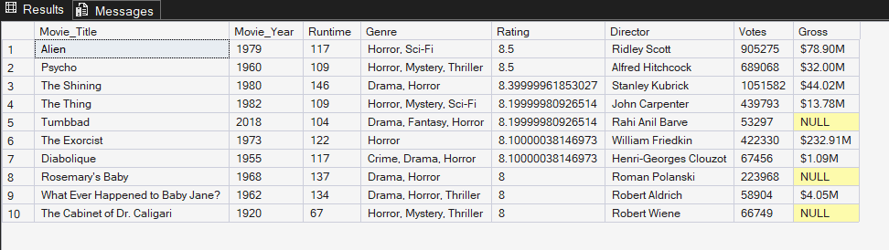
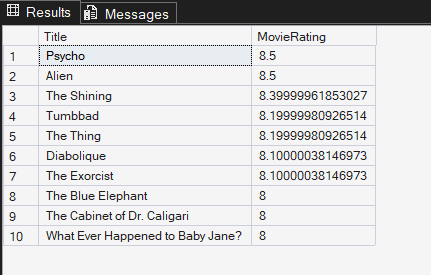
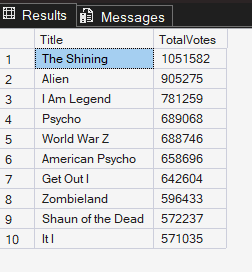
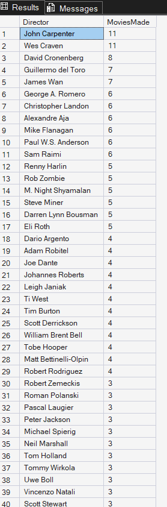
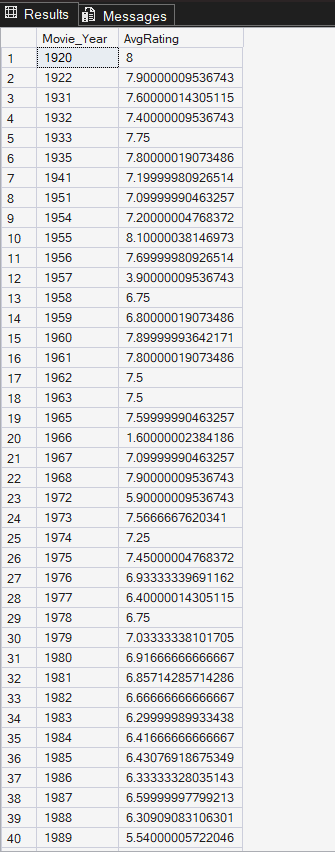
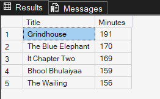
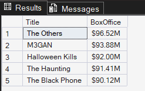
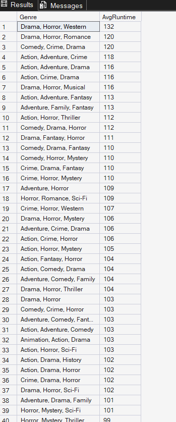
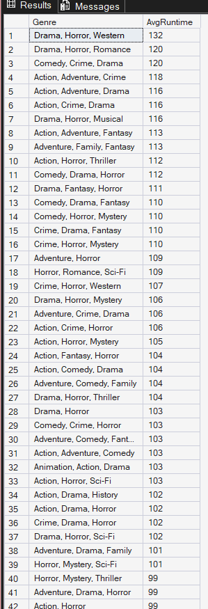
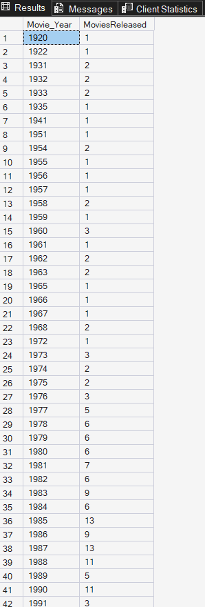

# Horror Movies Data Analysis

This repository contains a SQL analysis of the IMDb Horror Movies dataset.  
The project demonstrates key SQL skills including selection, sorting, grouping, aggregating, and creating insights from a real dataset.

---

## Dataset

**Source:** [IMDb Horror Movies on Kaggle](https://www.kaggle.com/datasets/shreyanshverma27/imdb-horror-chilling-movie-dataset?select=Horror+Movies+IMDb.csv)  

**Columns:**

- `Movie_Title` – Title of the movie  
- `Movie_Year` – Year the movie was released  
- `Runtime` – Runtime in minutes  
- `Genre` – Genre of the movie  
- `Rating` – IMDb rating  
- `Director` – Director of the movie  
- `Votes` – Number of IMDb votes  
- `Gross` – Box office gross (if available)

> **Note:** The full dataset is hosted on Kaggle. This repository includes SQL queries and screenshots of the results. If you want to run the queries yourself, download the CSV from Kaggle and load it into your database. You can optionally include a small subset of the data for demonstration.

---

## SQL Queries and Insights

### 1. Explore Dataset: First 10 Rows
**Query:** Show a sample of the dataset to check data integrity.  
  
**Insight:** “This shows a sample of the dataset including titles, years, genres, and ratings.”

---

### 2. Top 10 Highest Rated Horror Movies
**Query:** Retrieve the top 10 movies by IMDb rating.  
  
**Insight:** “These are the critically best-received horror movies in the dataset.”

---

### 3. Most Popular Horror Movies by Votes
**Query:** Retrieve the top 10 movies by number of votes.  
  
**Insight:** “Shows the audience favorites based on the number of votes.”

---

### 4. Directors with the Most Horror Movies
**Query:** Count of movies per director.  
  
**Insight:** “Identifies the most prolific directors in the horror genre.”

---

### 5. Average Rating by Year
**Query:** Calculate average movie rating per year.  
  
**Insight:** “Tracks how the average rating of horror movies changed over time.”

---

### 6. Top 5 Longest Horror Movies
**Query:** Retrieve the 5 movies with the longest runtime.  
  
**Insight:** “Highlights the epic-length horror movies.”

---

### 7. Top 5 Highest Grossing Horror Movies
**Query:** Retrieve the top 5 movies by box office gross.  
  
**Insight:** “Shows the most commercially successful horror movies.”

---

### 8. Average Runtime by Genre
**Query:** Calculate average runtime for each genre.  
  
**Insight:** “Reveals which horror genres tend to produce longer movies.”

---

### 9. Average Rating by Director
**Query:** Calculate average rating for each director.  
  
**Insight:** “Highlights directors who consistently make highly rated horror movies.”

---

### 10. Movies Released per Year
**Query:** Count of movies released each year.  
  
**Insight:** “Shows production trends and how horror movie output changes over time.”

---

## How to Run

1. Open **SQL Server Management Studio** (SSMS) and connect to your server.  
2. Open `HorrorMoviesAnalysis.sql` in a new query window.  
3. Make sure to **select the correct database** where `HorrorMoviesData` is stored.  
4. Execute queries individually or as a full batch.  
5. View the **Results grid** for insights (this is what is captured in the screenshots).  
